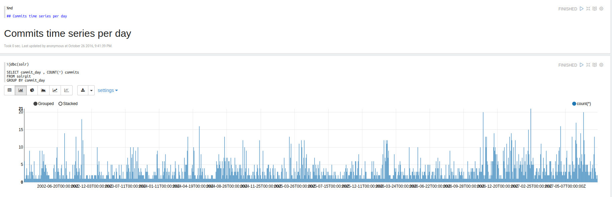
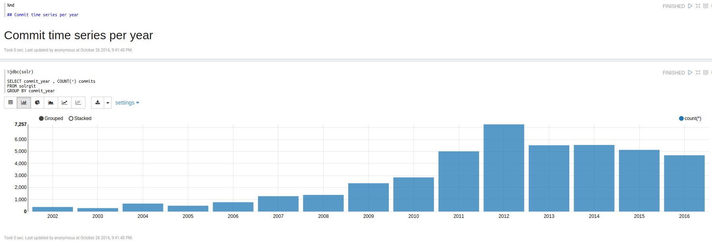
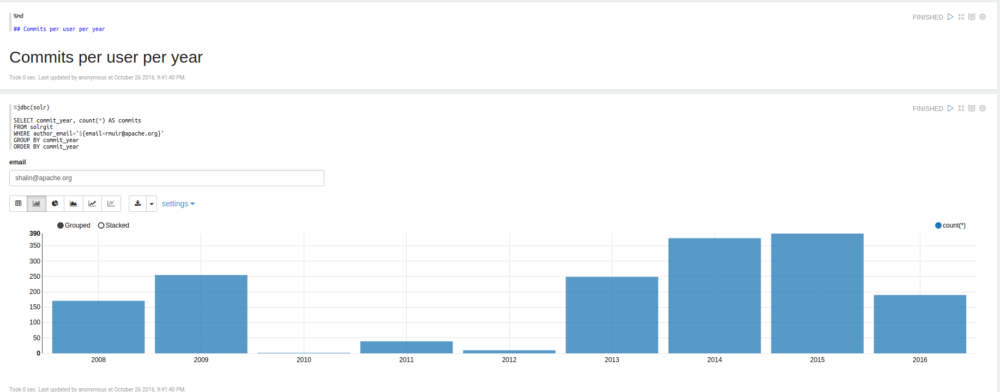

lucene-solr git commits project
===============================

Simple project used to push the commit data taken from lucene-solr GIT
repository and push it towards a solr server.
This simple project is actually used only to collect training data for an
experiment with the Solr JDBC driver used via Apache Zeppelin. 

For the purpose of this test the software packages :

* apache solr 6.2.1 
* apache zeppelin 0.6.1

were used.

Once the data is posted and commited to the solrgit collection, it can
be analyzed via a Zeppelin notebook.


Below is presented a glimpse on the type of queries that can be done via Zeppelin








## Create the Solr collection:


```
bin/solr create_core -c solrgit -d /home/marius/java/solrgit/conf

```


## Delete all documents  from the Solr collection

```
curl http://localhost:8983/solr/solrgit/update\?stream.body\=\<delete\>\<query\>\*:\*\</query\>\</delete\>\&commit\=true
```


## Libraries used

The library used for collecting the data from the GIT commits was eclipse's jgit
and for posting the data towards Solr was solrj.


## Zeppelin Solr JDBC

Since version 6 of Solr has been introduced a JDBC driver which can be configured on Zeppelin
to run a subset of SQL queries on Solr.
 
 
Some informations on how to setup Solr JDBC driver on Apache Zeppelin can be found here:

* http://opensourceconnections.com/blog/2016/05/18/its_a_ballon_a_blimp_no_a_dirigible/
* https://www.linkedin.com/pulse/apache-solr-jdbc-zeppelin-incubating-kevin-risden


The notebook used for performing the queries presented above can be found at the location:

* ./zeppelin/notebook/solr-git-analysis.json


## Zeppelin & Spark & Solr

Zeppelin offers also the possibility to perform [Spark](http://spark.apache.org/) operations
on Solr via [spark-sql](http://spark.apache.org/) driver, but at the time of writing this
sample code, the spark-sql driver was causing issues because its current version (2.2.1) is compiled
with scala 2.10, but zeppelin on the other hand is compiled with scala 2.11